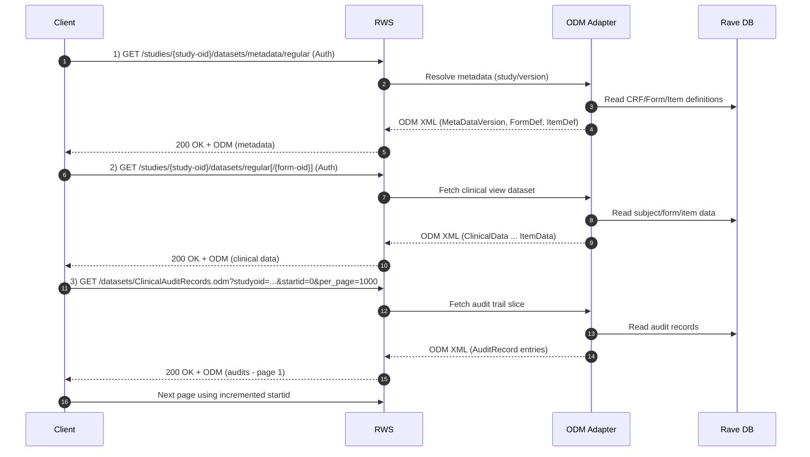
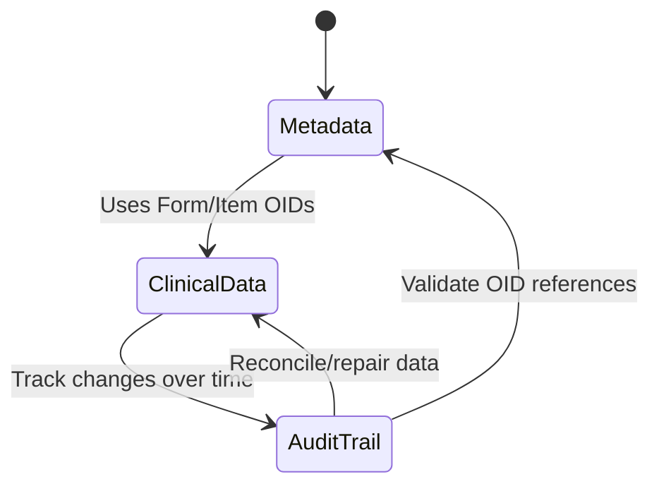
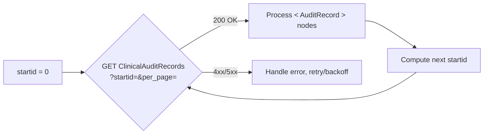
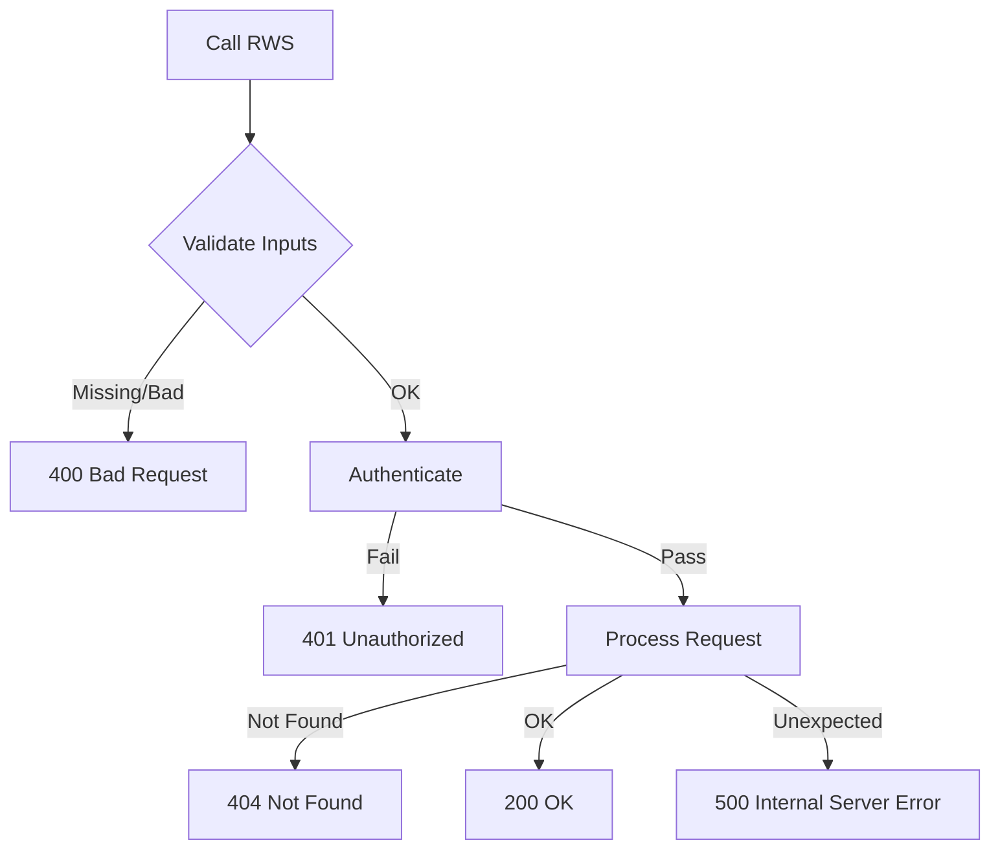

# 🎯 RWS Visual Companion — Metadata → Clinical Data → Audit Logs

**Purpose:** HTML-ready Markdown with diagrams that illustrate how the three RWS endpoints work together across the data lifecycle.  
**Endpoints covered:**
- `GET /studies/{study-oid}/datasets/metadata/regular` (ODM metadata)
- `GET /studies/{study-oid}/datasets/{regular-or-raw}[/{form-oid}]` (ODM clinical data)
- `GET /datasets/ClinicalAuditRecords.odm` (ODM audit trail, paginated)

---

## 1) Big Picture: Data Lifecycle Map

```mermaid
flowchart LR
    subgraph Prep[Preparation]
      A[Authenticate<br/>(Basic or MAuth)]
      B[Select Study OID]
    end

    subgraph Meta[Metadata Extraction]
      M1[GET /studies/{study-oid}/datasets/metadata/regular<br/><i>ODM 1.3</i>]
      M2[ODM: Study → MetaDataVersion → Forms/Items]
    end

    subgraph Data[Clinical Data Extraction]
      D1[GET /studies/{study-oid}/datasets/{regular|raw}[/{form-oid}]<br/><i>ODM 1.3</i>]
      D2[ODM: ClinicalData → SubjectData → FormData → ItemData]
    end

    subgraph Audit[Audit Trail Extraction]
      A1[GET /datasets/ClinicalAuditRecords.odm?<br/>studyoid&startid&per_page[&unicode][&mode]]
      A2[ODM: ClinicalData → AuditRecord entries (paged)]
    end

    A --> B --> M1
    M1 --> M2 --> D1 --> D2 --> A1 --> A2
```

> **Why this order?**  
> - **Metadata** defines form/item OIDs used to parse clinical & audit payloads.  
> - **Clinical Data** uses those OIDs to deliver values per subject/form.  
> - **Audit Logs** provide the transactional lineage of those values.

---

## 2) Component View (HTML-ready)

```mermaid
graph TD
  Client[Client / ETL / AI Agent] -->|HTTPS + Auth| RWS[Rave Web Services]

  subgraph Rave EDC
    DB[(Rave DB)]
    ODM[ODM Adapter]
  end

  RWS --> ODM
  ODM --> DB

  RWS -->|/studies/{study-oid}/datasets/metadata/regular| Client
  RWS -->|/studies/{study-oid}/datasets/{regular-or-raw}[/{form-oid}]| Client
  RWS -->|/datasets/ClinicalAuditRecords.odm| Client
```

---

## 3) End-to-End Sequence (Happy Path)



---

## 4) Request/Response Mapping

### 4.1 Metadata (ODM)
**Request**
```
GET /RaveWebServices/studies/{study-oid}/datasets/metadata/regular?codelistsuffix=_CL&decodesuffix=_DECODE&versionitem=_VER&rawsuffix=_RAW
Authorization: (Basic|MAuth)
Accept: application/xml
```

**Response (ODM 1.3 sketch)**
```xml
<ODM>
  <Study OID="Study(Prod)">
    <MetaDataVersion OID="timestamp-or-version">
      <FormDef OID="DM" Name="Demographics"/>
      <ItemDef OID="DM.AGE" Name="AGE" DataType="integer"/>
      <!-- ... -->
    </MetaDataVersion>
  </Study>
</ODM>
```

### 4.2 Clinical Data (ODM)
**Request**
```
GET /RaveWebServices/studies/{study-oid}/datasets/regular/DM?versionitem=_VER
```

**Response (ODM 1.3 sketch)**
```xml
<ODM>
  <ClinicalData StudyOID="Study(Prod)">
    <SubjectData SubjectKey="SUBJ001">
      <StudyEventData StudyEventOID="SCREENING">
        <FormData FormOID="DM" FormRepeatKey="1">
          <ItemGroupData ItemGroupOID="DM">
            <ItemData ItemOID="DM.AGE" Value="34"/>
          </ItemGroupData>
        </FormData>
      </StudyEventData>
    </SubjectData>
  </ClinicalData>
</ODM>
```

### 4.3 Audit Records (ODM, paginated)
**Request**
```
GET /RaveWebServices/datasets/ClinicalAuditRecords.odm?studyoid=Study(Prod)&startid=0&per_page=1000[&unicode=true][&mode=enhanced]
```

**Response (ODM 1.3 sketch)**
```xml
<ODM>
  <ClinicalData StudyOID="Study(Prod)">
    <AuditRecord ID="12345" User="jsmith" Action="Update" Timestamp="2025-10-20T09:00:00Z">
      <Field OID="AE.AEDESC" OldValue="HEADACHE" NewValue="MIGRAINE"/>
    </AuditRecord>
  </ClinicalData>
</ODM>
```

---

## 5) Lifecycle Controls & Options



**Key switches and suffixes**  
- `codelistsuffix`: include code list OIDs  
- `decodesuffix`: include decode values for coded fields  
- `rawsuffix`: include raw values (regular datasets)  
- `versionitem`: include CRF version value  
- Audit options: `unicode=true`, `mode=enhanced|all` (depending on platform version)

---

## 6) Pagination Strategy (Audit)



**Tips**
- Use stable checkpoints (persist last successful `startid`).  
- Tune `per_page` based on throughput & response size.  
- If `mode` is supported, switch to `enhanced`/`all` only after backfill is complete.

---

## 7) Error Handling Flow



**Common causes**
- 400: malformed query, bad types, invalid OIDs  
- 401: missing or invalid credentials/signature  
- 404: study/dataset/form not accessible  
- 500: server-side export failure or transient outage

---

## 8) Minimal cURL Recipes

```bash
# Metadata
curl -u user:pass "https://{host}/RaveWebServices/studies/{study-oid}/datasets/metadata/regular?codelistsuffix=_CL&decodesuffix=_DECODE"

# Clinical Data (form-level)
curl -u user:pass "https://{host}/RaveWebServices/studies/{study-oid}/datasets/regular/{form-oid}?versionitem=_VER"

# Audit (paged)
curl -u user:pass "https://{host}/RaveWebServices/datasets/ClinicalAuditRecords.odm?studyoid={study-oid}&startid=0&per_page=1000&unicode=true"
```

---

## 9) Implementation Checklist

- [ ] Use HTTPS, set `Accept: application/xml`  
- [ ] Prefer **MAuth** for long-lived services  
- [ ] URL-encode `study-oid` (e.g., `(Prod)` → `%28Prod%29`)  
- [ ] Fetch **metadata first**, cache OIDs & structures  
- [ ] Pull clinical data; add decode/raw/unit suffixes as needed  
- [ ] Stream/paginate audits, checkpoint `startid`  
- [ ] Implement retries with exponential backoff  
- [ ] Log response headers (e.g., `X-MWS-CV-Last-Updated`) for sync diagnostics  

---

*End of visual companion.*
