# 🎯 RWS Visual Companion — Metadata → Clinical Data → Audit Logs (GitHub-Compatible)

**Purpose:** HTML-safe Markdown and GitHub-compatible Mermaid diagrams illustrating how the three RWS endpoints connect through the data lifecycle.  
**Endpoints covered:**
- `GET /studies/(study-oid)/datasets/metadata/regular` (ODM metadata)
- `GET /studies/(study-oid)/datasets/(regular-or-raw)/(form-oid)` (ODM clinical data)
- `GET /datasets/ClinicalAuditRecords.odm` (ODM audit trail, paginated)

---

## 1) Big Picture: Data Lifecycle Map



```mermaid
flowchart LR
    subgraph Prep[Preparation]
      A[Authenticate &#40;Basic or MAuth&#41;]
      B[Select Study OID]
    end

    subgraph Meta[Metadata Extraction]
      M1[GET /studies/&#40;study-oid&#41;/datasets/metadata/regular]
      M2[ODM: Study → MetaDataVersion → Forms & Items]
    end

    subgraph Data[Clinical Data Extraction]
      D1[GET /studies/&#40;study-oid&#41;/datasets/&#40;regular or raw&#41;/&#40;form-oid&#41;]
      D2[ODM: ClinicalData → SubjectData → FormData → ItemData]
    end

    subgraph Audit[Audit Trail Extraction]
      A1[GET /datasets/ClinicalAuditRecords.odm?studyoid&startid&per_page]
      A2[ODM: ClinicalData → AuditRecord entries &#40;paged&#41;]
    end

    A --> B --> M1
    M1 --> M2 --> D1 --> D2 --> A1 --> A2
```

> **Why this order?**
> - **Metadata** defines form/item OIDs used to parse clinical & audit payloads.
> - **Clinical Data** delivers subject-level records using those OIDs.
> - **Audit Logs** provide transactional lineage for those values.

---

## 2) Component View (GitHub-Compatible)


---

## 3) End-to-End Sequence


---

## 4) Request/Response Mapping

### Metadata (ODM)
```
GET /RaveWebServices/studies/(study-oid)/datasets/metadata/regular
Authorization: Basic or MAuth
Accept: application/xml
```
**Response**
```xml
<ODM>
  <Study OID="Study&#40;Prod&#41;">
    <MetaDataVersion OID="2025-10-20T00:00:00Z">
      <FormDef OID="DM" Name="Demographics"/>
      <ItemDef OID="DM.AGE" Name="AGE" DataType="integer"/>
    </MetaDataVersion>
  </Study>
</ODM>
```

### Clinical Data &#40;ODM&#41;
```
GET /RaveWebServices/studies/&#40;study-oid&#41;/datasets/regular/&#40;form-oid&#41;
```
**Response**
```xml
<ODM>
  <ClinicalData StudyOID="Study&#40;Prod&#41;">
    <SubjectData SubjectKey="SUBJ001">
      <FormData FormOID="DM">
        <ItemGroupData ItemGroupOID="DM">
          <ItemData ItemOID="DM.AGE" Value="34"/>
        </ItemGroupData>
      </FormData>
    </SubjectData>
  </ClinicalData>
</ODM>
```

### Audit Data &#40;ODM&#41;
```
GET /RaveWebServices/datasets/ClinicalAuditRecords.odm?studyoid=Study&#40;Prod&#41;&startid=0&per_page=1000
```
**Response**
```xml
<ODM>
  <ClinicalData StudyOID="Study&#40;Prod&#41;">
    <AuditRecord ID="1234" User="jsmith" Action="Update" Timestamp="2025-10-20T09:00:00Z">
      <Field OID="AE.AEDESC" OldValue="HEADACHE" NewValue="MIGRAINE"/>
    </AuditRecord>
  </ClinicalData>
</ODM>
```

---

## 5&#41; Lifecycle State Map


---

## 6&#41; Pagination Flow for Audits


---

## 7&#41; Error Handling Flow


---

## 8&#41; Minimal cURL Examples

```bash
# Metadata
curl -u user:pass "https://{host}/RaveWebServices/studies/{study-oid}/datasets/metadata/regular"

# Clinical Data &#40;form-level&#41;
curl -u user:pass "https://{host}/RaveWebServices/studies/{study-oid}/datasets/regular/{form-oid}"

# Audit &#40;paged&#41;
curl -u user:pass "https://{host}/RaveWebServices/datasets/ClinicalAuditRecords.odm?studyoid={study-oid}&startid=0&per_page=1000"
```

---

## 9&#41; Implementation Checklist

- [ ] Use HTTPS &#40;`Accept: application/xml`&#41;
- [ ] Prefer **MAuth** over Basic for services
- [ ] URL-encode `study-oid`
- [ ] Retrieve metadata first
- [ ] Pull clinical data &#40;decoded/raw/unit variants&#41;
- [ ] Stream/paginate audit datasets
- [ ] Implement retry logic &#40;HTTP 500/429&#41;
- [ ] Cache response headers for sync diagnostics

---

*End of GitHub-compatible RWS Visual Companion.*
